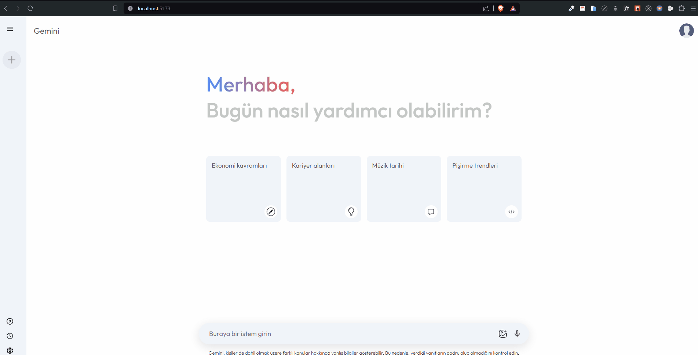
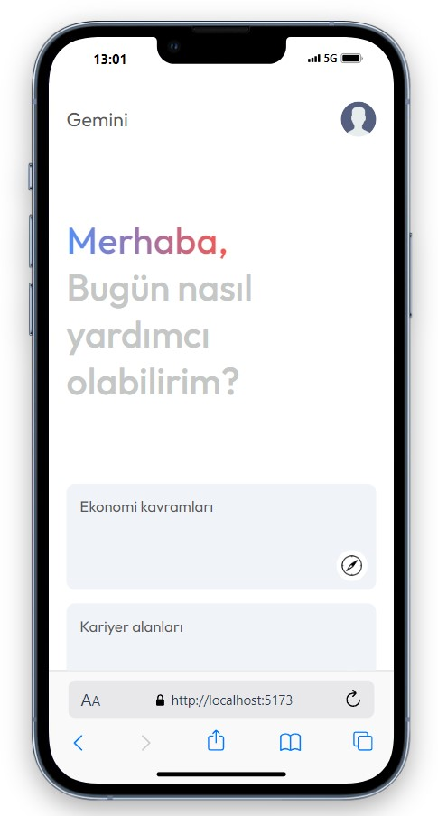
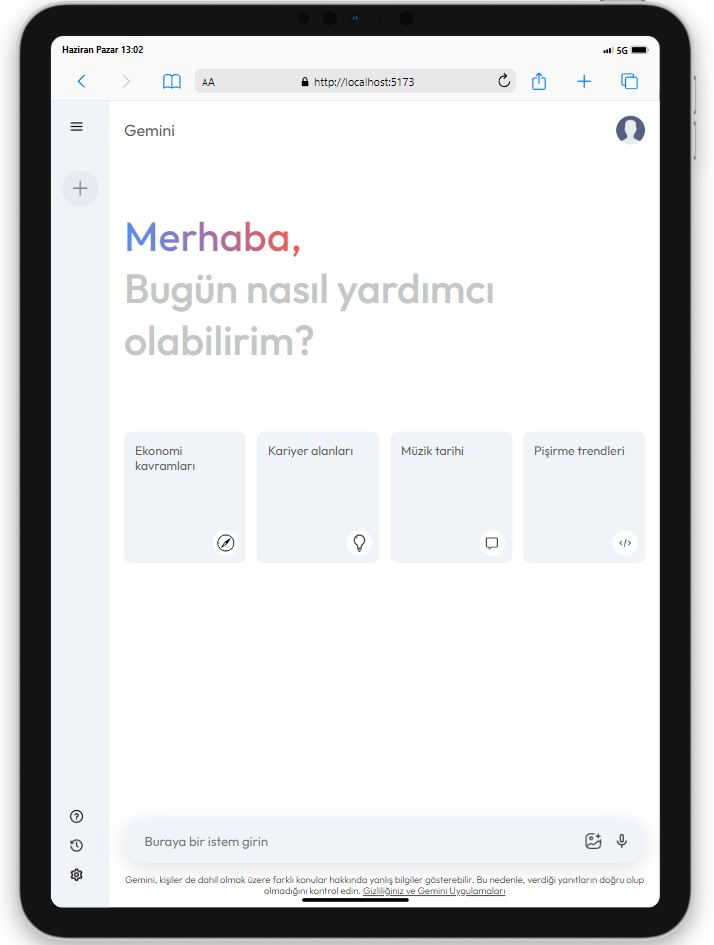
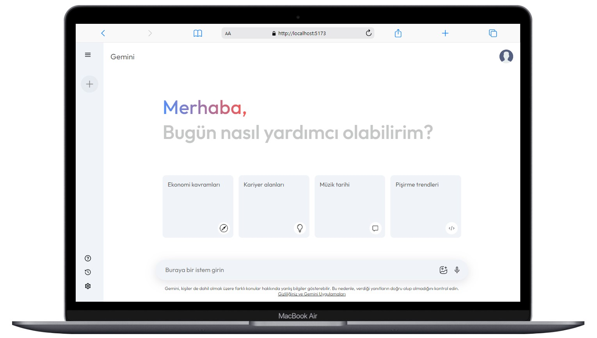

# Gemini Clone

<div align="center">
  
</div>

## About the Project

This project is a frontend application that creates a chat application using the Google Gemini API. The application is developed using React.js and Context API.

## Table of Contents

- [Technologies Used](#technologies-used)
- [Usage](#usage)
- [Project Skeleton](#project-skeleton)
- [Screenshots](#screenshots)

## Live Demo

[Gemini Clone](https://gemini-clone-fd.vercel.app/)

## Technologies Used

- React
- [Vite](https://vitejs.dev/)
- Context API
- Styling with [SCSS](https://sass-lang.com/)
- [Google Gemini API](https://ai.google.dev) for data 

## Usage

- Click the menu icon in the top left corner to open the sidebar.
- Click the "New Chat" button to start a new conversation.
- Enter a prompt in the input box and press Enter or click the send icon to submit.
- Responses will be displayed below the prompts.

## Project Skeleton

```
Gemini Clone (folder)
│    
├── public
│    └── favicon.png
├── src
│    ├── assets
│    │     └── [images]
│    ├── components
│    │     ├── Home.jsx  
│    │     └── Sidebar.jsx  
│    ├── config
│    │     └── gemini.js 
│    ├── context
│    │     └── Context.jsx
│    ├── helpers   
│    │     └── assets.js
│    ├── scss
│    │     ├── abstracts
│    │     │      └── _mixin.scss
│    │     ├── base
│    │     │      └── _reset.scss
│    │     ├── components
│    │     │      ├── _home.scss
│    │     │      ├── _responsive.scss
│    │     │      └── _sidebar.scss
│    │     └── index.scss
│    ├── App.jsx
│    └── main.jsx
├── .eslintrc.cjs
├── .gitignore
├── index.html
├── package-lock.json
├── package.json
├── README.md
└── vite.config.js
```

## Screenshots

<div align="center">
  
  
  
</div>

## Compatibility

The project is compatible with both wide-screen computers and mobile devices.